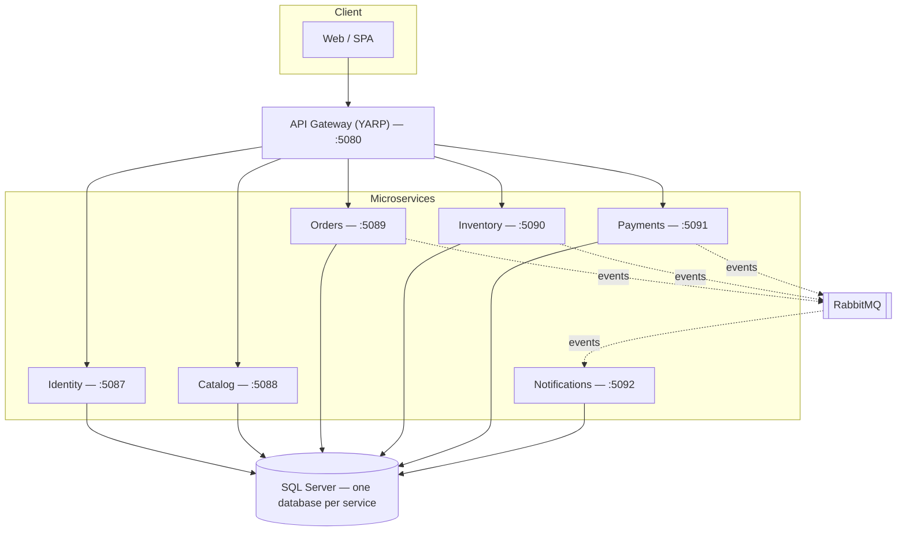
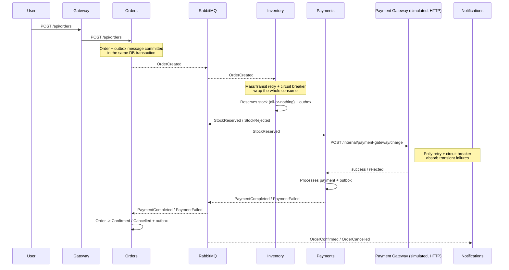
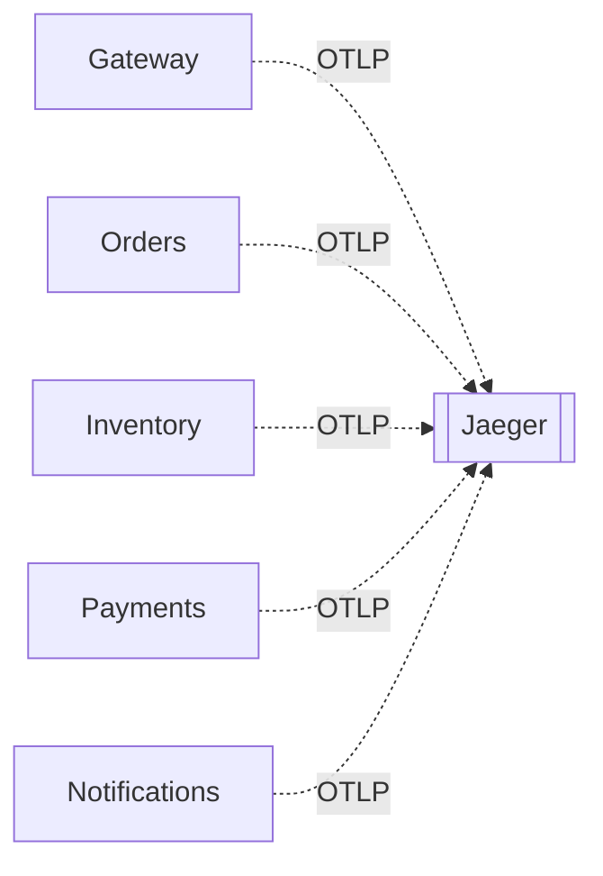
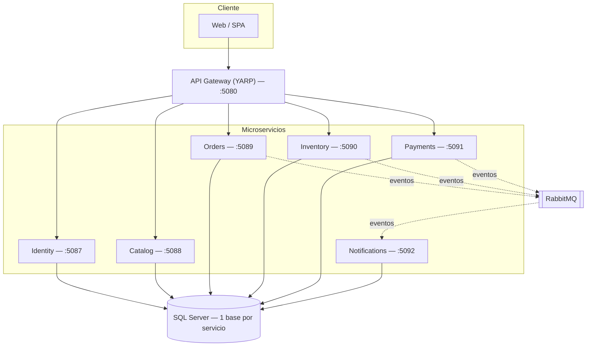
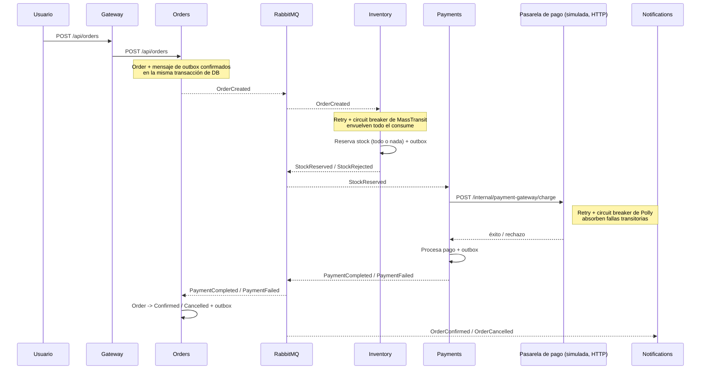

<p align="center">
  <a href="#english">🇺🇸 English</a> · <a href="#español">🇦🇷 Español</a>
</p>

---

<a name="english"></a>
# E-commerce Microservices

E-commerce platform built as **independent microservices**, each following **Clean Architecture** and **CQRS** internally, persisting to **SQL Server** and communicating asynchronously via **RabbitMQ/MassTransit**. Portfolio project designed to demonstrate distributed-systems design judgment, not just familiarity with a framework.

## Architecture

7 services, each exclusively owning its own database:



| Service | Responsibility | Database | Communication |
|---|---|---|---|
| **Identity** | Registration, login, JWT issuance | `identity_db` | REST |
| **Catalog** | Products, categories, prices (read-heavy) | `catalog_db` | REST |
| **Orders** | Order lifecycle, orchestrates the checkout saga | `orders_db` | REST + events |
| **Inventory** | Stock per product, all-or-nothing reservations | `inventory_db` | events |
| **Payments** | Payment authorization (simulated gateway) | `payments_db` | events |
| **Notifications** | Simulated email delivery on order events | `notifications_db` | events |
| **Gateway** | Single entry point (YARP) | — | — |

### Clean Architecture per service

The 6 business-logic services share the same layering template:

```
Domain          → Entities, business invariants, repository interfaces
Application     → Commands/Queries (MediatR), validators (FluentValidation)
Infrastructure  → EF Core, SQL Server, MassTransit, repositories
Api             → Minimal APIs, JWT authentication
```

The dependency rule always points toward Domain: `Infrastructure` implements interfaces that `Domain` defines, never the other way around.

### CQRS

Commands and queries travel different paths. In **Catalog** and **Orders**, the read model is a denormalized projection living in its own table, separate from the write model.

### Checkout saga (choreographed, no central orchestrator)



If stock isn't sufficient or the payment is rejected, the order is cancelled and, in the payment-rejected case, the reserved stock is automatically released (compensation).

Every DB write above is paired with its outbox message in the same transaction (MassTransit's EF Core Outbox — Bus Outbox for the HTTP-triggered `CreateOrder`, the consumer transactional outbox for everything triggered by a consumer), so a crash between "write" and "publish" can no longer lose or duplicate an event. Every consume is wrapped in MassTransit retry + circuit breaker, and the payment gateway call goes through a Polly-resilient `HttpClient` (retry, circuit breaker, timeout) that only retries genuine transient failures — a business rejection (amount too high) is never retried.

### Observability: distributed tracing with Jaeger

Every hop above — the HTTP entry at the Gateway, each RabbitMQ publish/consume (including the outbox), and the HTTP call to the payment gateway — is instrumented with OpenTelemetry and correlated under a single trace ID, exported via OTLP to Jaeger:



With the stack up, open `http://localhost:16686`, pick a service (e.g. `gateway-api`) and search recent traces: a single trace connects every span across the 5 services — including the individual RabbitMQ publish/consume operations and, whenever Polly retries the payment gateway call, the retried HTTP attempt as its own span.

## Tech stack

| Layer | Technology |
|---|---|
| Runtime | .NET 8 |
| API | ASP.NET Core Minimal APIs |
| CQRS / Mediator | MediatR |
| Validation | FluentValidation |
| ORM | Entity Framework Core |
| Database | SQL Server |
| Messaging | RabbitMQ + MassTransit |
| Outbox | MassTransit EF Core Outbox (Bus Outbox + consumer transactional outbox) |
| Resilience | MassTransit retry/circuit breaker, Polly (`Microsoft.Extensions.Http.Resilience`) |
| Observability | OpenTelemetry, Jaeger (OTLP) |
| Gateway | YARP |
| Auth | JWT Bearer |
| Containers | Docker, Docker Compose |
| Testing | xUnit, FluentAssertions, Moq, Testcontainers |

## Running it

### With Docker (recommended)

Spins up the 7 services + SQL Server + RabbitMQ + Jaeger with a single command (migrations run automatically on startup):

```bash
docker compose up --build
```

Once it's up, everything goes through the Gateway at `http://localhost:5080`, and traces are visible at `http://localhost:16686` (Jaeger UI):

```bash
# Register
curl -X POST http://localhost:5080/api/auth/register \
  -H "Content-Type: application/json" \
  -d '{"email":"demo@example.com","password":"SuperSecret123"}'

# Login
curl -X POST http://localhost:5080/api/auth/login \
  -H "Content-Type: application/json" \
  -d '{"email":"demo@example.com","password":"SuperSecret123"}'

# Create a product (public)
curl -X POST http://localhost:5080/api/products/ \
  -H "Content-Type: application/json" \
  -d '{"sku":"BOOK-001","name":"Clean Architecture","description":"...","category":"Books","price":45.90}'
```

Each service also exposes its own Swagger UI (e.g. `http://localhost:5087/swagger` for Identity).

To tear everything down:

```bash
docker compose down
```

### Locally, without Docker

You'll need SQL Server and RabbitMQ running (you can spin up just those two with Docker) plus the .NET 8 SDK:

```bash
dotnet restore
dotnet build
dotnet run --project src/services/Identity/Identity.Api
# ...one `dotnet run` per service you want to bring up
```

Each service's development connection strings live in its own `appsettings.json` (pointing at `localhost`).

## Tests

**151 tests** across unit and integration:

```bash
# Unit tests (Domain + Application, with mocks — run in milliseconds)
dotnet test tests/Identity.Tests tests/Catalog.Tests tests/Orders.Tests \
  tests/Inventory.Tests tests/Payments.Tests tests/Notifications.Tests

# Integration tests (real SQL Server and RabbitMQ via Testcontainers — requires Docker)
dotnet test --settings tests/IntegrationTests/.runsettings
```

| Type | Where | What it covers |
|---|---|---|
| Unit | `tests/{Service}.Tests` | Entity business rules, command/query handlers with mocks, validators |
| Per-service integration | `tests/IntegrationTests/{Service}.IntegrationTests` | Real HTTP endpoints against a real SQL Server; for the messaging services, also the real consumers against a real RabbitMQ |
| Saga integration | `tests/IntegrationTests/Saga.IntegrationTests` | The 4 saga services (Orders/Inventory/Payments/Notifications) running together, talking over a real RabbitMQ — happy path, insufficient stock, and payment rejection with compensation |

The `.runsettings` under `tests/IntegrationTests` runs the integration projects one at a time: with Testcontainers spinning up several SQL Server/RabbitMQ instances at once, the default parallelism saturates Docker on a typical dev machine.

## Repository structure

```
src/
  services/
    Identity/       Identity.Domain / Application / Infrastructure / Api
    Catalog/        (same 4-layer template)
    Orders/
    Inventory/
    Payments/
    Notifications/
    Gateway/        Gateway.Api (YARP, no layers — it's config-driven)
  shared/
    ECommerce.Contracts/      Integration events shared across services
    ECommerce.Observability/  OpenTelemetry wiring shared across the 5 saga services
tests/
  {Service}.Tests/                                Unit tests
  IntegrationTests/{Service}.IntegrationTests/     Integration tests
  IntegrationTests/Saga.IntegrationTests/          Full saga integration test
docker-compose.yml
```

---

<a name="español"></a>
# E-commerce Microservices (Español)

<p align="right"><a href="#english">↑ Read this in English</a></p>

Plataforma de e-commerce construida como **microservicios independientes**, cada uno con **Clean Architecture** y **CQRS** por dentro, persistiendo en **SQL Server** y comunicándose de forma asíncrona vía **RabbitMQ/MassTransit**. Proyecto de portfolio pensado para demostrar criterio de diseño de sistemas distribuidos, no solo dominio de un framework.

## Arquitectura

7 servicios, cada uno dueño exclusivo de su base de datos:



| Servicio | Responsabilidad | Base de datos | Comunicación |
|---|---|---|---|
| **Identity** | Registro, login, emisión de JWT | `identity_db` | REST |
| **Catalog** | Productos, categorías, precios (lectura muy superior a la escritura) | `catalog_db` | REST |
| **Orders** | Ciclo de vida del pedido, orquesta la saga de checkout | `orders_db` | REST + eventos |
| **Inventory** | Stock por producto, reservas todo-o-nada | `inventory_db` | eventos |
| **Payments** | Autorización de pago (gateway simulado) | `payments_db` | eventos |
| **Notifications** | Envío simulado de emails ante eventos de pedido | `notifications_db` | eventos |
| **Gateway** | Punto de entrada único (YARP) | — | — |

### Clean Architecture por servicio

Los 6 servicios con lógica de negocio comparten la misma plantilla de capas:

```
Domain          → Entidades, invariantes de negocio, interfaces de repositorio
Application     → Commands/Queries (MediatR), validadores (FluentValidation)
Infrastructure  → EF Core, SQL Server, MassTransit, repositorios
Api             → Minimal APIs, autenticación JWT
```

La regla de dependencia siempre apunta hacia el Domain: `Infrastructure` implementa interfaces que `Domain` define, nunca al revés.

### CQRS

Comandos y queries viajan por caminos distintos. En **Catalog** y **Orders** el modelo de lectura es una proyección desnormalizada en su propia tabla, separada del modelo de escritura.

### Saga de checkout (coreografiada, sin orquestador central)



Si el stock no alcanza o el pago es rechazado, el pedido se cancela y, en el caso del pago rechazado, el stock reservado se libera automáticamente (compensación).

Cada escritura en base de datos de arriba va acompañada de su mensaje de outbox en la misma transacción (Outbox de EF Core de MassTransit — Bus Outbox para el `CreateOrder` disparado por HTTP, outbox transaccional de consumer para todo lo disparado por un consumer), así que una caída entre "escribir" y "publicar" ya no puede perder ni duplicar un evento. Cada consume queda envuelto en retry + circuit breaker de MassTransit, y la llamada a la pasarela de pago pasa por un `HttpClient` con resiliencia de Polly (retry, circuit breaker, timeout) que solo reintenta fallas transitorias genuinas — un rechazo de negocio (monto demasiado alto) nunca se reintenta.

### Observabilidad: tracing distribuido con Jaeger

Cada salto de arriba — la entrada HTTP en el Gateway, cada publish/consume de RabbitMQ (incluido el outbox), y la llamada HTTP a la pasarela de pago — está instrumentado con OpenTelemetry y correlacionado bajo un único trace ID, exportado vía OTLP a Jaeger:


Con el stack arriba, abrí `http://localhost:16686`, elegí un servicio (por ejemplo `gateway-api`) y buscá trazas recientes: un único trace conecta todos los spans de los 5 servicios — incluidas las operaciones individuales de publish/consume de RabbitMQ y, cada vez que Polly reintenta la llamada a la pasarela de pago, el intento reintentado como su propio span.

## Stack técnico

| Capa | Tecnología |
|---|---|
| Runtime | .NET 8 |
| API | ASP.NET Core Minimal APIs |
| CQRS / Mediator | MediatR |
| Validación | FluentValidation |
| ORM | Entity Framework Core |
| Base de datos | SQL Server |
| Mensajería | RabbitMQ + MassTransit |
| Outbox | Outbox de EF Core de MassTransit (Bus Outbox + outbox transaccional de consumer) |
| Resiliencia | Retry/circuit breaker de MassTransit, Polly (`Microsoft.Extensions.Http.Resilience`) |
| Observabilidad | OpenTelemetry, Jaeger (OTLP) |
| Gateway | YARP |
| Autenticación | JWT Bearer |
| Contenedores | Docker, Docker Compose |
| Testing | xUnit, FluentAssertions, Moq, Testcontainers |

## Cómo correrlo

### Con Docker (recomendado)

Levanta los 7 servicios + SQL Server + RabbitMQ + Jaeger con un solo comando (incluye migraciones automáticas al arrancar):

```bash
docker compose up --build
```

Una vez arriba, todo pasa por el Gateway en `http://localhost:5080`, y las trazas se ven en `http://localhost:16686` (UI de Jaeger):

```bash
# Registrarse
curl -X POST http://localhost:5080/api/auth/register \
  -H "Content-Type: application/json" \
  -d '{"email":"demo@example.com","password":"SuperSecret123"}'

# Login
curl -X POST http://localhost:5080/api/auth/login \
  -H "Content-Type: application/json" \
  -d '{"email":"demo@example.com","password":"SuperSecret123"}'

# Crear un producto (público)
curl -X POST http://localhost:5080/api/products/ \
  -H "Content-Type: application/json" \
  -d '{"sku":"BOOK-001","name":"Clean Architecture","description":"...","category":"Books","price":45.90}'
```

Cada servicio también expone su propio Swagger (por ejemplo `http://localhost:5087/swagger` para Identity).

Para bajar todo:

```bash
docker compose down
```

### Local, sin Docker

Necesitas SQL Server y RabbitMQ corriendo (puedes levantar solo esos dos con Docker) y el SDK de .NET 8:

```bash
dotnet restore
dotnet build
dotnet run --project src/services/Identity/Identity.Api
# ...un `dotnet run` por cada servicio que quieras levantar
```

Las cadenas de conexión de desarrollo están en el `appsettings.json` de cada servicio (apuntan a `localhost`).

## Tests

**151 tests** entre unitarios e integración:

```bash
# Unitarios (Domain + Application, con mocks — corren en milisegundos)
dotnet test tests/Identity.Tests tests/Catalog.Tests tests/Orders.Tests \
  tests/Inventory.Tests tests/Payments.Tests tests/Notifications.Tests

# Integración (SQL Server y RabbitMQ reales vía Testcontainers — requiere Docker)
dotnet test --settings tests/IntegrationTests/.runsettings
```

| Tipo | Dónde | Qué cubre |
|---|---|---|
| Unitarios | `tests/{Servicio}.Tests` | Reglas de negocio de las entidades, command/query handlers con mocks, validadores |
| Integración por servicio | `tests/IntegrationTests/{Servicio}.IntegrationTests` | Endpoints HTTP reales contra SQL Server real; en los servicios con mensajería, también los consumers reales contra RabbitMQ real |
| Integración de la saga | `tests/IntegrationTests/Saga.IntegrationTests` | Los 4 servicios de la saga (Orders/Inventory/Payments/Notifications) corriendo juntos, hablando por un RabbitMQ real — camino feliz, stock insuficiente y pago rechazado con compensación |

El `.runsettings` de `tests/IntegrationTests` corre los proyectos de integración de a uno: con Testcontainers arrancando varios SQL Server/RabbitMQ en simultáneo, el paralelismo por defecto satura Docker en una máquina de desarrollo normal.

## Estructura del repositorio

```
src/
  services/
    Identity/       Identity.Domain / Application / Infrastructure / Api
    Catalog/        (misma plantilla de 4 capas)
    Orders/
    Inventory/
    Payments/
    Notifications/
    Gateway/        Gateway.Api (YARP, sin capas — es config-driven)
  shared/
    ECommerce.Contracts/      Eventos de integración compartidos entre servicios
    ECommerce.Observability/  Cableado de OpenTelemetry compartido entre los 5 servicios de la saga
tests/
  {Servicio}.Tests/                        Unitarios
  IntegrationTests/{Servicio}.IntegrationTests/   Integración
  IntegrationTests/Saga.IntegrationTests/         Integración de la saga completa
docker-compose.yml
```
